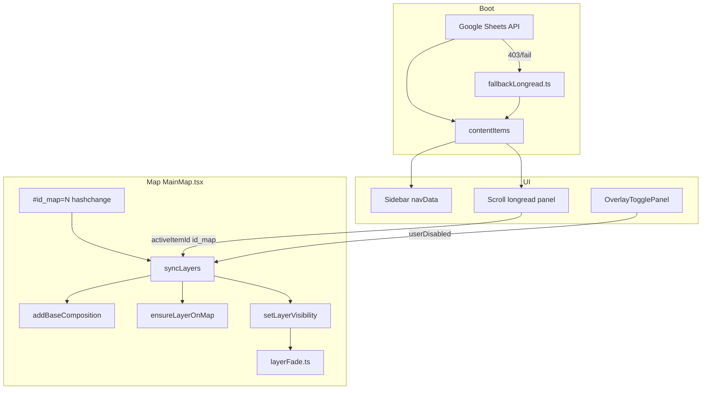

# Handoff: как работает сайт сейчас (2026-06-28)

**START HERE** для следующего агента.  
**Корень проекта:** `C:\Work\SPb_Mountains\SPb_Mountains`  
**Production:** [https://spbmlaplus.github.io/SPb_Mountains/](https://spbmlaplus.github.io/SPb_Mountains/)  
**Репозиторий:** `spbmlaplus/SPb_Mountains`, ветка `main`  
**Последний деплой:** commit `76c7523` — *Phase 5 polish: mask opacity, styles, layers, and longread updates.*

Не коммитить / не пушить без явной просьбы заказчика.

---

## Что это

SPA «СПб Горы» — интерактивная карта (MapLibre GL) + scroll-лонгрид о горном ландшафте Петербурга. Пользователь листает главы справа (desktop) или в карусели (mobile); карта синхронизируется с активным пунктом через `id_map` и `#id_map=N` в URL.

Стек: **React 19 + Vite 7 + MapLibre GL + Tailwind**. Тайлы растра — отдельный репозиторий [`spb_mountains_tiles`](https://github.com/spbmlaplus/spb_mountains_tiles).

---

## Структура репозитория

| Путь | Назначение |
|------|------------|
| [`src/MainMap.tsx`](../src/MainMap.tsx) | Карта, sync слоёв, longread, hash routing, клики |
| [`src/layerFade.ts`](../src/layerFade.ts) | Fade-in/out visibility, hover opacity |
| [`src/layerStyles.ts`](../src/layerStyles.ts) | `VECTOR_STYLES` — runtime paint по имени стиля |
| [`src/sectionOverlays.ts`](../src/sectionOverlays.ts) | `SECTION_OVERLAYS[id_map]` из JSON-манифеста |
| [`src/baseCompositions.ts`](../src/baseCompositions.ts) | Базовая композиция карты (растр + векторы) |
| [`src/fallbackLongread.ts`](../src/fallbackLongread.ts) | Авто-лонгрид (57 пунктов), если Google Sheets недоступен |
| [`src/clickTrigger.ts`](../src/clickTrigger.ts) | Кликабельные слои, folder_vector, popup |
| [`src/assets/sections/section-overlays.json`](../src/assets/sections/section-overlays.json) | Манифест слоёв по `id_map` 1–23 |
| [`src/assets/layers/*.geojson`](../src/assets/layers/) | Runtime GeoJSON (копия из `new_files/layers/`) |
| [`new_legend/`](../new_legend/) | CSV/XLSX — источник правды для лонгрида и легенды |
| [`new_files/`](../new_files/) | QGIS-экспорт: layers, styles, photos, mount |
| [`scripts/`](../scripts/) | Генераторы манифестов и ассетов |
| [`.github/workflows/deploy.yml`](../.github/workflows/deploy.yml) | GitHub Pages deploy на push в `main` |

---

## Архитектура runtime



---

## Longread

1. При загрузке `MainMap` пытается загрузить Google Sheet (`sheetsApiKey` в `MainMap.tsx`). При ошибке — [`fallbackLongread.ts`](../src/fallbackLongread.ts) (генерируется `scripts/gen-fallback-longread.py` из `new_legend/longread (2).xlsx`).
2. Каждый `ContentItem` имеет `id`, `id_map`, `base_id`, `chapter`, `paragraphs`, опционально `zoom.layer`.
3. Scroll-sync: активный пункт определяется пересечением с viewport; карта летит к bbox слоя `zoom.layer` или home view.
4. Deep link: `#id_map=3` → первый longread-item с этим `id_map`.
5. Типы текста: обычный paragraph, **fact** (`.longread-fact`), **era** (`.longread-era`, regex в `contentTypes.ts`).

Nav sidebar: [`navData.ts`](../src/navData.ts) — главы «01 Горный Петербург» … «05 Горы сейчас», секторы 01–13.

---

## Карта и слои

### Базовая композиция (всегда снизу)

Из [`base-composition.json`](../src/assets/styles/base-composition.json) (`scripts/gen-base-map.py` ← `new_legend/BASE_MAP.csv`):

- Positron nolabels (CARTO)
- `relief_water1` @ 55% — `https://spbmlaplus.github.io/spb_mountains_tiles/relief_water1/{z}/{x}/{y}.png`
- Векторы: `sectors_level`, `isoline_5m`, `amphitheater_bound`, …

`BASE_COMPOSITIONS[1]` — единственная активная база (ключи 1|2|3 сохранены для совместимости с моделью longread).

### Overlay по секции (`id_map`)

[`SECTION_OVERLAYS[id_map]`](../src/sectionOverlays.ts) из [`section-overlays.json`](../src/assets/sections/section-overlays.json):

- `layers[]` — mandatory + optional (чекбоксы в «Слои»)
- `inscriptions[]` — подписи centroid (`N.geojson`)
- `folder_vectors[]` — точка → полигон (id_map 23 viewpoints)
- `default_base` — какая база (сейчас везде 1)

### syncLayers (главный цикл)

В `useEffect` при смене `activeItemId` / toggles:

1. Swap base composition если `base_id` изменился
2. Собрать `visibleFiles = mandatory ∪ optional \ userDisabled`
3. Для каждого файла: `ensureLayerOnMap` → `setLayerVisibility` → category filters → `registerLayerHoverFade`

### ensureLayerOnMap

[`MainMap.tsx`](../src/MainMap.tsx) ~L745:

- Загружает GeoJSON из [`layerUrls.ts`](../src/layerUrls.ts)
- Paint из `VECTOR_STYLES[styleName]`, fallback — legacy mask/elements palette
- Sub-layer ID: `content-fill-{file}`, `content-line-{file}`, `content-symbol-{file}`, …
- Point-symbol (`mount`): ▲ над всеми overlay (без `beforeId`)
- Polygon: fill + optional hatch + outline (если `outlineIsVisible`)
- **HMR refresh:** если слой уже есть — `setLayerPaint()` обновляет paint без пересоздания

---

## Стили (VECTOR_STYLES)

Цепочка merge в [`layerStyles.ts`](../src/layerStyles.ts) (последний wins):

```
layer-styles.json (QML)
  → withMountStyles, withEstateStyles, withClubStyles, …
  → withMountPolygonStyles   // #acacac 50%
  → withMaskStyles           // чёрный 35%, без контура
  → withHistoricalResettlementStyles
  → withFinnsStyles          // finns_* buckets, size ×2
```

Ключевые runtime overrides (не только manifest):

| Стиль | Fill | Outline |
|-------|------|---------|
| `mask_*` (все 5) | `rgb(0,0,0)` @ **0.35** | прозрачный (line hidden) |
| `mount_polygon` | `#acacac` @ **0.5** | `#acacac` |
| `historical_resettlement` | `rgba(89,89,89,0.4784)` | нет |
| `mount` ▲ | symbol sizes: холм 6.5 / возвыш. 10 / гора 17 | без hover-fade |
| `finns_*` | circle, sizes 17 / 8.5 / 5.66 | — |

Реген манифеста: `scripts/gen-section-overlays.py` (не откатывать mask на зелёный контур).

---

## Visibility и opacity (важно)

[`layerFade.ts`](../src/layerFade.ts):

- `fadeLayerVisibility` — fade 0→target за 500ms (большинство overlay)
- `instantLayerVisibility` — без fade (`mount.geojson`, `mount_polygon.geojson`, id_map 13/14)
- `registerLayerHoverFade` — boost ×1.15 на hover (не для mount ▲)

**Fix маски (commit 76c7523):** после show fade/instant раньше ставил `fill-opacity: 1` для всех sub-layer → маски выглядели непрозрачными.

Сейчас в [`setLayerVisibility`](../src/MainMap.tsx):

```typescript
// whitelist: mask_*.geojson + mount_polygon.geojson
// TargetOpacityResolver → fill-opacity из VECTOR_STYLES только для content-fill-{file}
// symbol/circle centroids (estate, mount ▲) → по-прежнему target 1
```

**Не делать:** глобальный `registerLayerPaintTargets` для всех sub-layer — ломает centroids (text-opacity/circle-opacity запоминается как 0).

---

## Клики и popup

- [`clickTrigger.ts`](../src/clickTrigger.ts) — конфиг кликабельных слоёв по `id_map`, `click_trigger`, classify categories
- [`mapHighlight.ts`](../src/mapHighlight.ts) — подсветка выбранного feature
- Popups: `MountainPopup`, `MountainPhotoModal`, `ViewpointPhotoModal`, painting fullscreen (id_map 21)
- Centroid ×3 при клике — **убрано**, не возвращать

---

## UI / mobile

- Desktop: [`layout.tsx`](../src/layout.tsx) — Sidebar + карта + longread + `SectorDetailPanel`
- Mobile v2: carousel longread, 45dvh map / 55dvh text, bottom-sheet popup ([`MobileLongreadControls`](../src/MobileLongreadControls.tsx))
- [`OverlayTogglePanel`](../src/OverlayTogglePanel.tsx) — чекбоксы optional layers + category toggles
- id_map 23: «Смотровые точки» / «Пешеходные маршруты» — первые в списке «Слои»

---

## Деплой

Push в `main` → [`.github/workflows/deploy.yml`](../.github/workflows/deploy.yml):

```yaml
VITE_TILE_BASE_URL: https://spbmlaplus.github.io/spb_mountains_tiles
VITE_BASE_PATH: /SPb_Mountains/
```

Локальная dev (полный parity с prod tiles):

```powershell
cd C:\Work\SPb_Mountains\SPb_Mountains
$env:VITE_TILE_BASE_URL = "https://spbmlaplus.github.io/spb_mountains_tiles"
$env:VITE_BASE_PATH = "/SPb_Mountains/"
npm run dev -- --host 127.0.0.1 --port 5175
npm run build
```

`vite.config.ts` игнорирует watch на `new_files/` и `new_legend/` (Windows EBUSY).

---

## Pipeline исходников

| Задача | Скрипт | Вход → выход |
|--------|--------|--------------|
| Longread fallback | `gen-fallback-longread.py` | xlsx → `fallbackLongread.ts` |
| Overlay manifest | `gen-section-overlays.py` | CSV/QML → `section-overlays.json` |
| Layer URLs | `gen-layer-urls.py` | geojson list → `layerUrls.ts` |
| Base map | `gen-base-map.py` | `BASE_MAP.csv` → `base-composition.json` |
| Copy assets | `copy-new-assets.py` | `new_files/` → `src/assets/` + `public/object_photos/` |
| QML → styles | `qml_to_style.py` | `.qml` → `layer-styles.json` |

После правок в `new_files/` или CSV — прогнать нужный скрипт, затем `npm run build`.

---

## QA (быстрый чеклист)

| Проверка | URL |
|----------|-----|
| Production live | [spbmlaplus.github.io/SPb_Mountains/](https://spbmlaplus.github.io/SPb_Mountains/) |
| mount ▲ + mount_polygon 50% | `#id_map=2` |
| Маски 35%, без контура | `#id_map=3`…`6`, `#id_map=7` |
| estate centroids | `#id_map=15` |
| Finns ×2 | `#id_map=12`, `#id_map=13` |
| historical_resettlement серый | `#id_map=12` |
| Viewpoints + routes | `#id_map=23` |
| Era captions | геологическая глава, scroll |
| Nav «01 Горный Петербург» | sidebar |
| Hard refresh после деплоя | Ctrl+F5 |

---

## Известные ограничения

- Google Sheets API часто 403 (referrer) → контент из fallback, это норма.
- `public/object_photos/` и `src/assets/object_photos/` в `.gitignore` — копируются локально через `copy-new-assets.py`, на Pages могут отсутствовать если не в dist.
- Большие geojson (isoline, walking_routes) — не коммитить лишнее; часть в gitignore.

---

## Не ломать без явной просьбы

- Whitelist fill-opacity для масок (`hasCustomFillOpacity` + `TargetOpacityResolver`)
- mount без hover-fade, instant visibility
- Finns ×2 sizes, compact inscriptions id_map 12–20
- `withMaskStyles` 35% / без контура (не возвращать зелёную обводку на все маски)
- Centroid ×3 — не возвращать
- Nav главы 06–11 убраны намеренно

---

## История handoff-доков

```
HANDOFF.md
  → phase2 … phase5-continuation.md
  → HANDOFF-phase5-layer-opacity.md  (проблема + fix описан)
  → HANDOFF-current-state.md         ← START HERE (этот файл)
```

Детали phase 5 polish: [`HANDOFF-phase5-continuation.md`](HANDOFF-phase5-continuation.md), [`HANDOFF-phase5-polish.md`](HANDOFF-phase5-polish.md).
