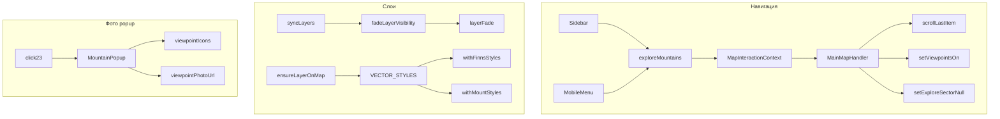

# Handoff: Фаза 4 — стили, popups, fade-in, id_map 13, навигация

**Дата:** 2026-06-28. **Читать первым:** [`HANDOFF-phase3-overhaul.md`](HANDOFF-phase3-overhaul.md), затем этот файл.  
**Корень проекта:** `C:\Work\SPb_Mountains\SPb_Mountains` (вложенный).  
**План-источник:** `.cursor/plans/phase_4_polish_2d79357a.plan.md` (не редактировать).

---

## Правила (как в фазе 3)

1. Windows: shell с `required_permissions: ["all"]`.
2. **Не коммитить / не пушить** без явной просьбы.
3. `layerStyles.ts` — **augment-only**; приоритет QML → section → base.
4. Блок `styles` в `section-overlays.json` — hand-tuned; после правок styles → `python scripts/gen-layers.py` (скрипт **сохраняет** блок).
5. Не hand-edit `layer-styles.json`.
6. Между шагами: `npm run build` + dev на `http://127.0.0.1:5175/`.
7. Эталон popup: `C:\Work\SPb_Mountains\примеры_оформления_сайта\4_пример.PNG`.

---

## Статус: что уже сделано в коде (сессия 2026-06-28)

| Блок | Статус | Файлы |
|------|--------|-------|
| Finns VECTOR_STYLES | ✅ | `src/layerStyles.ts` — `withFinnsStyles` регистрирует все `finns_*` из `section-overlays.sets` |
| historical_resettlement | ✅ | `section-overlays.json` styles + `withHistoricalResettlementStyles` (#000 @ 30%, без hatch в augment) |
| mount_polygon 50% / 0.2 | ✅ | `section-overlays.json` + `withMountPolygonStyles` |
| mount ▲ ×2 ramp | ✅ | `styles.mount.size_px`: 20→28 @ z9–z14; multipliers ×4/×2/×1 в `withMountStyles` |
| Inscription labels | ✅ | `MainMap.tsx` `ensureInscriptionOnMap`: 12px, Montserrat Bold |
| id_map 13 слои | ✅ | `new_legend/LAYERS.csv` + regen `section-overlays.json`: maki_selki@1, finns 2–10, inscription `13`@11 |
| Fade-in слоёв + hover | ✅ (код) | `src/layerFade.ts`, `fadeLayerVisibility` в `MainMap.tsx`, `registerLayerHoverFade` после sync |
| «Исследовать горы» | ✅ (код) | `MapInteractionContext.tsx`, `Sidebar.tsx`, `MobileMenu.tsx`, handler в `MainMap.tsx` |
| Viewpoints в context | ✅ | `viewpointsOn` / `setViewpointsOn` в `MapInteractionContext`; MainMap читает из context |
| id_map 23 фото в popup | ✅ (код) | `objectPhotos.ts` folder `"1"` → `viewpointPhotoUrl`; `MountainPopup.tsx` → `viewpointIcons` для thumb |
| Живопись icon-size | ✅ (код) | `MainMap.tsx`: icon-size как Viewpoints (0.55→1 @ z9–13) |
| Belveder Sheets filter | ✅ (код) | `MainMap.tsx` `belvederAllowed()` в `parseSheetRows` |
| Belveder fallback | ✅ | `gen-fallback-longread.py` (regen выполнен) |
| paintingPhotos + prep script | ⚠️ частично | `src/paintingPhotos.ts`, `scripts/prep-painting-images.py` — **иконки не сгенерированы** (`painting_images/` пуст) |
| npm run build | ❓ | **Не подтверждён** в прерванной сессии — обязательно прогнать |
| Browser QA | ❌ | estate, finns, mount fade, id_map 21/23, Belveder UI |
| HANDOFF обновлён | ✅ | этот файл |

---

## Архитектура изменений (для ориентации)



---

## Задачи для следующего агента (по приоритету)

### P0 — Сборка и smoke-тест гор

1. **`npm run build`** — исправить TS/lint если упадёт.
2. **`npm run dev -- --host 127.0.0.1`** — порт 5175 если занят.
3. **id_map 1–2:** ▲ чёрные, без белого halo; `mount_polygon` зелёная заливка 50%, тонкий контур того же цвета.
4. **Fade-in:** при scroll между id_map слои **появляются** (~500 ms), не «застревают» на opacity 0. Если mount пропадает — см. § «Известные риски».

**Файлы:** [`MainMap.tsx`](../src/MainMap.tsx), [`layerFade.ts`](../src/layerFade.ts), [`layerStyles.ts`](../src/layerStyles.ts).

---

### 1. Finns — визуальная приёмка

**Ожидание на id_map 12 и 13:**

| Паттерн в имени слоя | Диаметр circle | Цвет |
|----------------------|----------------|------|
| `count_100_plus` | 8.5 px | по pct-bucket |
| `count_10_100` | 4.25 px (÷2) | |
| `count_1_10` | ~2.83 px (÷3) | |
| `0_1` в имени | | `#149bdc` |
| `1_5` | | `#0030cd` |
| `5_plus` | | `#0a2b70` |

**Проверка:** глава «История горных финнов» (id_map 12), строки с id_map 13 (maki_selki + finns).

**Если точки оранжевые / дефолтные:** `VECTOR_STYLES['finns_0_1_count_100_plus']` должен существовать — смотреть `withFinnsStyles` в [`layerStyles.ts`](../src/layerStyles.ts).

---

### 2. id_map 13 — manifest

Уже в [`section-overlays.json`](../src/assets/sections/section-overlays.json):

| order | Слой |
|-------|------|
| 1 | `maki_selki` |
| 2–10 | 9 × `finns_*` (копия id_map 12) |
| 11 | inscription `13.geojson` |

Источник CSV: [`new_legend/LAYERS.csv`](../new_legend/LAYERS.csv) строки id_map 13.  
После правок CSV: `python scripts/gen-layers.py`.

---

### 3. «Исследовать горы»

**Реализовано.** По клику (Sidebar footer + collapsed vlabel, MobileMenu footer):

1. `scrollToItemId(contentItems.at(-1).id)` — fallback `longread-72-горные-активности`
2. `setViewpointsOn(true)`
3. `setExploreSector(null)`

**QA:** клик → лонгрид в конце (id_map 23), чекбокс «Точки обзора» ON, sector dim снят.

**Файлы:** [`MapInteractionContext.tsx`](../src/MapInteractionContext.tsx), [`Sidebar.tsx`](../src/Sidebar.tsx), [`MobileMenu.tsx`](../src/MobileMenu.tsx), [`layout.css`](../src/layout.css) (кнопки footer).

---

### 4. Estate popup (id_map 15–20)

Логика **уже была** в фазе 3: `MountainPopup` + `fitBounds` + pink highlight для типов Вилла, Особняк, Мыза, Усадьба, Дворец.

**QA в браузере:** клик по Дворец/Усадьба на id_map 15–20. Если не кликается — проверить `layersSyncGen` в deps click-effect, `fillForwardIdMap`, `classify: "type"`.

Фото `estate/` на диске **нет** — popup текстовый, это норма.

---

### 5. id_map 23 — фото Viewpoints в popup

**Реализовано в коде:**

- Клик `23_1_points` → `MountainPopup`, `photoFolder="1"`, `photoKey` = поле `name` ("1001"…)
- [`objectPhotos.ts`](../src/objectPhotos.ts): `resolveObjectPhotoUrl('1', key, 1)` → `viewpointPhotoUrl(key)`
- [`MountainPopup.tsx`](../src/MountainPopup.tsx): thumb из `viewpointIcons[key]`

**QA:** клик точки id_map 23 → popup с мини-квадратом + viewshed highlight чёрный 30%.

---

### 6. Живопись id_map 21 — мини-квадратики

**Сделано:** icon-size как Viewpoints; код грузит `paintingIcons[fid]` или fallback `object_photos/21/{fid}`.

**Не сделано:** генерация ассетов.

```powershell
cd C:\Work\SPb_Mountains\SPb_Mountains
pip install pillow   # если нет
# Положить фото в public/object_photos/21/ (сейчас public/ почти пуст)
python scripts/prep-painting-images.py
npm run build
```

Выход: `src/assets/painting_images/{fid}.webp` (84×84 @2x, белая плитка + shadow — как viewpoints).

---

### 7. Belveder — дедуп в UI

- Fallback: одна запись `longread-62`, `side: "full"`, caption после абзаца.
- Sheets: `belvederAllowed()` в `parseSheetRows`.
- **QA:** в лонгриде «Николай I…» — одно фото после текста, без дубля в «Как появились горы…».
- Legacy дубль в `new_legend/LONGREAD.csv` line 42 — не источник (источник xlsx).

---

### 8. Fade-in — донастройка при необходимости

[`layerFade.ts`](../src/layerFade.ts):

- `LAYER_FADE_IN_MS = 500`
- show: visibility visible → opacity 0 → rAF → opacity 1
- hide: opacity 0 → timeout → visibility none
- hover: ×1.15 opacity на sub-layers (может быть шумно на hatch — при лагах ограничить только clickable)

**Не путать** с откатанным crossfade между id_map (3.5 s overlap) — его **нет**.

---

### 9. Хвосты из phase2 / phase3 (не блокеры фазы 4)

| Хвост | Где |
|-------|-----|
| Viewpoints auto-off после гл.01 | `HANDOFF-phase2-polish.md` §5 — **не реализовано** |
| `landscape_7` имена geojson vs fill_categories | phase3 QA |
| `15.geojson` inscription WARNING | норма при gen-layers |

---

## Ключевые файлы (карта)

| Назначение | Путь |
|------------|------|
| Карта, fade, explore handler | `src/MainMap.tsx` |
| Fade utility | `src/layerFade.ts` |
| Стили augment | `src/layerStyles.ts` |
| Манифест id_map | `src/assets/sections/section-overlays.json` |
| CSV слоёв | `new_legend/LAYERS.csv` |
| Context навигации | `src/MapInteractionContext.tsx` |
| Sidebar / Mobile | `src/Sidebar.tsx`, `src/MobileMenu.tsx` |
| Popup + фото | `src/MountainPopup.tsx`, `src/objectPhotos.ts` |
| Viewpoint icons | `src/viewpointPhotos.ts` |
| Painting icons | `src/paintingPhotos.ts`, `scripts/prep-painting-images.py` |
| Click config | `src/clickTrigger.ts` |
| Fallback longread | `scripts/gen-fallback-longread.py` → `src/fallbackLongread.ts` |

---

## Стили (эталонные значения)

### mount

```json
"size_px": { "z_low": 9, "size_low": 20, "z_high": 14, "size_high": 28 }
```

`withMountStyles`: ▲ чёрный, `гора×4`, `возвышенность×2`, без halo.

### mount_polygon

```json
"fill": { "color": "rgb(185, 219, 210)", "opacity": 0.5 },
"outline": { "color": "rgb(185, 219, 210)", "width_px": 0.2 }
```

### historical_resettlement

```json
"fill": { "color": "#000000", "opacity": 0.3 }
```

Без line-layer если `outline.width === 0` или outline отсутствует — [`MainMap.tsx`](../src/MainMap.tsx) `ensureLayerOnMap`.

---

## Пайплайн

```powershell
cd C:\Work\SPb_Mountains\SPb_Mountains
python scripts/gen-layers.py              # после правок LAYERS.csv / styles
python scripts/gen-fallback-longread.py   # после правок xlsx/longread
python scripts/prep-painting-images.py    # когда есть public/object_photos/21/
$env:Path += ";C:\Program Files\nodejs"
$env:VITE_TILE_BASE_URL="https://spbmlaplus.github.io/spb_mountains_tiles"
$env:VITE_BASE_PATH="/"
npm run build
npm run dev -- --host 127.0.0.1
```

---

## QA checklist (приёмка фазы 4)

- [ ] `npm run build` зелёный
- [ ] id_map 1–2: ▲ видимы, mount_polygon 50%/0.2
- [ ] Fade: слои появляются плавно, mount не «исчезает»
- [ ] id_map 12/13: finns 9 слоёв, 3 размера, 3 цвета
- [ ] id_map 13: maki_selki + finns + inscription 13
- [ ] historical_resettlement: чёрный 30%, без контура
- [ ] «Исследовать горы» → последний item + Точки обзора ON
- [ ] id_map 15–20: estate popup (Вилла/Особняк/Усадьба/Дворец)
- [ ] id_map 23: popup thumb + viewshed
- [ ] id_map 21: квадратные иконки (после prep-painting-images)
- [ ] Belveder: одно фото в разделе Николай I

---

## Известные риски / баги для проверки

1. **Fade + symbol layers (mount ▲):** MapLibre использует `text-opacity`, не `fill-opacity`. `layerFade.ts` уже включает `text-opacity` для type `symbol`. Если ▲ невидимы после scroll — проверить, что fade завершается на factor=1 и target opacity store не 0.

2. **Hover fade:** `registerLayerHoverFade` вызывается при каждом `syncLayers` — `hoverRegistered` Set предотвращает двойную регистрацию, но при hot reload может понадобиться сброс.

3. **`public/object_photos/`** пуст в репо — фото 21/1/estate только после `copy-new-assets.py` + локальные файлы.

4. **gen-layers.py** перезаписывает `sets`, но **сохраняет** `styles` — править styles в JSON или через gen-layers hand-tune, не только CSV.

5. **Explore handler** зависит от `contentItems` — при первом mount до загрузки Sheets fallback уже есть (`fallbackLongreadItems`).

---

## Deep-link для QA

- `#id_map=12` — finns  
- `#id_map=13` — maki_selki + finns  
- `#id_map=21` — живопись  
- `#id_map=23` — маршруты / точки  
- `#item=longread-72-горные-активности` — последний блок  

---

## Связь с предыдущими handoff

- Crossfade между id_map (3.5 s) — **откат**, не возвращать без явного ТЗ.
- Fade-in opacity (500 ms) — **новое**, отличать от crossfade.
- Phase 3 blocks 1–8 — см. [`HANDOFF-phase3-overhaul.md`](HANDOFF-phase3-overhaul.md); browser QA там тоже не закрыта.

---

*Следующий агент: начать с `npm run build`, затем browser QA по checklist сверху вниз.*
