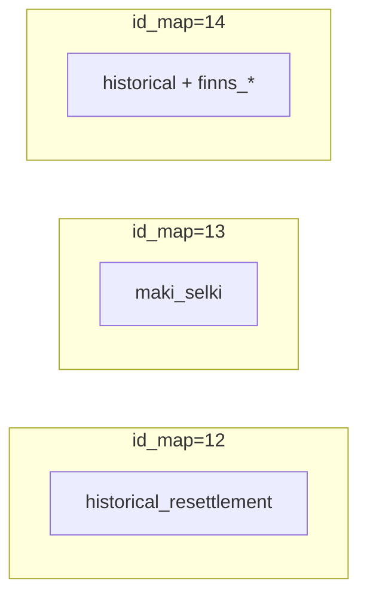
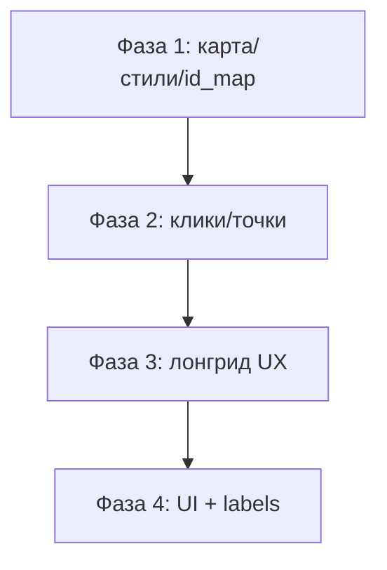

# План улучшений SPb Mountains (QA, июль 2026)

**Production:** https://spbmlaplus.github.io/SPb_Mountains/  
**Корень:** `C:\Work\SPb_Mountains\SPb_Mountains`  
**Статус:** реализация **остановлена** — документ для следующей сессии.

---

## Разбивка замечаний на блоки

| Блок | Пункты | Суть |
|------|--------|------|
| **A. Базовая карта и стили** | 1, 7, 9, 32 | Изолинии, цвета слоёв, старт без мелькания |
| **B. Переназначение id_map** | 18–21, 28–31 | Схема карт 12/13/14 + правки лонгрида |
| **C. Кликабельность и попапы** | 2, 8, 16, 17, 22–23, 26 | Клики, описания, route highlight, шире попап |
| **D. Лонгрид UX** | 3–6, 10–11, 13, 24 | Подсветка, типографика, скролл, зум, автопрокрутка |
| **E. Слои и точки** | 12, 15, 27 | Точки обзора, панель карт, коллизия подписей |
| **F. UI-контролы** | 14, 25, 33 | Кнопки слои/север/навигация, загрузочный экран |

Дубли в исходном списке объединены: 8=23, 18=28, 22=26.

---

## Подтверждённая схема id_map (п. 18–31)

| id_map | Слои | Где в лонгриде |
|--------|------|----------------|
| **12** | только `historical_resettlement`, кликабельный, подписи из `name` | Начало гл.3 «История горных финнов» |
| **13** | только `maki_selki`, кликабельный, подписи из `name` | «Мяки и Сельки», «Pietarin valot» |
| **14** | как был id_map=12 (historical + все `finns_*`) | «Призрак Ингерманландии» |



**Правки лонгрида (`fallbackLongread.ts` / xlsx):**

- Начало гл.3 → `id_map: 12`
- Мяки и Сельки → `id_map: 13`
- Pietarin valot → `id_map: 13` (было 14)
- Призрак Ингерманландии → `id_map: 14` (было 13)
- Старт сайта → `id_map: 1` (вместо 2)

---

## Блок A — Базовая карта и стили

### A1. Изолинии (п.1)

Конфиг в [`src/assets/styles/base-composition.json`](../src/assets/styles/base-composition.json): `#b99a87`, `0.11px`.

**Проверить в runtime:**

- `addBaseComposition()` в [`MainMap.tsx`](../src/MainMap.tsx) добавляет `isoline_5m`
- Слой не перекрывается relief raster / overlay anchor
- При необходимости поднять isoline в `render_order` базовой композиции

### A2. Цвета слоёв (п.7, 9)

В [`layerStyles.ts`](../src/layerStyles.ts):

- **Дом / Дача** (`estate`): `#f39dc6`
- **Приневская песчаная терраса** (`landscape_7`): fill `#fff1d3` @ 85%, без outline

### A3. Старт без мелькания (п.32)

Причина: `syncLayers()` создаёт overlay видимыми, потом скрывает ([`layerFade.ts`](../src/layerFade.ts)).

**Исправление:**

- Создавать слои с `visibility: none` до первого `setLayerVisibility` ([`hideSubLayersForFile`](../src/MainMap.tsx))
- На старте активен только **id_map=1**
- Опционально: lazy-load overlay batch

---

## Блок B — Переназначение id_map

### B1. Манифест [`section-overlays.json`](../src/assets/sections/section-overlays.json)

- **id_map 12:** только `historical_resettlement`, `click_trigger: true`
- **id_map 13:** только `maki_selki`, `click_trigger: true`
- **id_map 14:** копия старого id_map=12 (historical + finns)

### B2. Подписи

- id_map 12/13: runtime-метки из столбца `name` ([`nameLabels.ts`](../src/nameLabels.ts) + `ensureNameLabelsFromLayer` в MainMap)
- id_map 14: inscription `12.geojson` как сейчас

### B3. Лонгрид

См. таблицу выше + [`fallbackLongread.ts`](../src/fallbackLongread.ts).

---

## Блок C — Кликабельность и попапы

### C1. Горы, холмы, возвышенности (п.8, 23)

- В `mount` categories: `click_trigger: true` для `холм` и `возвышенность`
- [`MountainPopup.tsx`](../src/MountainPopup.tsx): показывать `description`

### C2. historical_resettlement, maki_selki (п.18, 21)

- `click_trigger: true` в манифесте
- Popup + highlight по аналогии с `mount`

### C3. id_map=22 (п.22, 26)

Слои `walking_routes`, `paragliding_clubs`, `horse_riding_clubs`, `ski_resorts`, `golf_clubs`, `motocross` — `click_trigger: true`, popup с `name` и атрибутами.

### C4. Route не весь горит (п.16)

При клике на `routes` искать полный feature по `name` в source, не сегмент MultiLineString (`resolveFullRouteFeature`).

### C5. Попап шире (п.17)

[`App.css`](../src/App.css): `.mountain-popup` ~300–340px, `max-height` описания больше.

---

## Блок D — Лонгрид UX

### D1. Подсветка по элементам (п.2)

Подэлементы: subtitle → text → photo → caption → fact.

- Классы `longread-el--*`
- CSS: неактивные `opacity: 0.45`, активный — `1`
- Опционально: `IntersectionObserver` для поэлементного spy

### D2. Типографика (п.3–5)

- Активный текст +1 размер
- `.longread-divider`: 85–90% ширины
- `.longread-chapter`: на всю ширину панели

### D3. Старт скролла с начала (п.6)

- `listRef.scrollTop = 0` после загрузки
- `activeItemId = items[0].id`

### D4. Сброс зума (п.13)

- При scroll лонгрида после map interaction → `flyTo(initialViewRef)` или zoom активного item
- Сброс `lastZoomKeyRef` при выходе из explore mode

### D5. Автопрокрутка (п.10–11)

[`longreadAutoscroll.ts`](../src/longreadAutoscroll.ts):

- Мин. 2 сек на элемент
- Главы: 3 сек; остальные: `clamp(4000, charCount * 40, 10000)` мс
- Пауза при ручном скролле

### D6. Мобильный скролл (п.24)

- Скролл на всей панели bottom sheet
- `scroll-snap-type: y proximity`

---

## Блок E — Слои и точки

### E1. Точки обзора (п.12)

- Убрать отдельный `Viewpoints.geojson`
- Единый источник: `23_1_points.geojson`
- Фото в popup через [`viewpointPhotos.ts`](../src/viewpointPhotos.ts)

### E2. Панель карт (п.15)

[`MapLayerPanel.tsx`](../src/MapLayerPanel.tsx):

| id_map | Название | Поведение |
|--------|----------|-----------|
| 1 | Горы Петербурга | одиночная |
| 3–7 | Из чего состоит амфитеатр? | взаимоисключающая группа |
| 11 | Геология гор | одиночная |
| 12 | Горные финны | одиночная |
| 15 | Высочайшие наблюдатели | одиночная |
| 22 | Горы и современность | слои id_map 22 |

Режим `manualIdMap` — независимо от scroll лонгрида.

### E3. Коллизия подписей (п.27)

- `text-allow-overlap: false`, `text-optional: true`
- `text-size` interpolation по zoom
- `symbol-sort-key` по важности

---

## Блок F — UI-контролы

### F1. Кнопки карты (п.14, 25)

[`MapControls.tsx`](../src/MapControls.tsx):

- **Слои** → `MapLayerPanel`
- **Север** → `easeTo({ bearing: 0, pitch: 0 })`
- **Навигация** → zoom +/−

Референс: `примеры_оформления_сайта/слои_телефонная_версия.png`, иконка: [`src/assets/icons/layers.svg`](../src/assets/icons/layers.svg).

### F2. Загрузочный экран (п.33)

[`SplashModal.tsx`](../src/SplashModal.tsx): до `mapReady && contentLoaded`, закрытие крестиком / кликом снаружи.

---

## Порядок реализации



| Фаза | Задачи | Ключевые файлы |
|------|--------|----------------|
| **1** | A1–A3, B1–B3, C4, C1 | `MainMap.tsx`, `layerStyles.ts`, `section-overlays.json`, `fallbackLongread.ts` |
| **2** | C2–C3, C5, E1 | `clickTrigger.ts`, `MountainPopup.tsx`, `MainMap.tsx` |
| **3** | D1–D6 | `MainMap.tsx`, `App.css`, `MobileLongreadSheet.tsx`, `longreadAutoscroll.ts` |
| **4** | E2–E3, F1–F2 | `MapControls.tsx`, `MapLayerPanel.tsx`, `SplashModal.tsx` |

---

## Что уже сделано (незакоммичено)

Частичная реализация в рабочей копии — **требует проверки и доработки**:

| Область | Статус | Файлы |
|---------|--------|-------|
| Цвета Дом/Дача, Приневская терраса | сделано | `layerStyles.ts` |
| id_map 12/13/14 в манифесте | сделано | `section-overlays.json` |
| mount холм/возвышенность clickable | сделано | `section-overlays.json` |
| id_map 22 layers clickable | сделано | `section-overlays.json` |
| fallback id_map 1, Pietarin/Призрак | сделано | `fallbackLongread.ts` |
| hide layers on create, priority sync | сделано | `MainMap.tsx` |
| dynamic name labels 12/13 | сделано | `nameLabels.ts`, `MainMap.tsx` |
| route full highlight | сделано | `MainMap.tsx` |
| viewpoints → 23_1_points | частично | `MainMap.tsx` |
| MapControls, MapLayerPanel, Splash | частично | новые компоненты |
| longread CSS, popup width | частично | `App.css` |
| autoscroll, zoom reset on scroll | частично | `MainMap.tsx`, `longreadAutoscroll.ts` |
| Изолинии runtime fix | **не проверено** | `base-composition.json`, `MainMap.tsx` |
| IntersectionObserver подэлементов | **не сделано** | `MainMap.tsx` |
| `npm run build` | **не прогнан** | — |

---

## QA-чеклист

- [ ] `npm run dev` — нет flash слоёв, виден id_map=1, isoline видны
- [ ] Лонгрид с начала (longread-0), не с Назарова
- [ ] Гл.3: historical → maki_selki → Призрак (finns+historical)
- [ ] Клик: гора/холм/мяки/route — полный highlight + description
- [ ] Кнопки слои/север/зум на desktop и mobile
- [ ] Splash закрывается крестиком и кликом снаружи
- [ ] `npm run build` без ошибок

---

## Команды

```bash
cd C:\Work\SPb_Mountains\SPb_Mountains
npm run dev
npm run build
```

---

## Связанные документы

- [`HANDOFF-current-state.md`](HANDOFF-current-state.md) — текущая архитектура
- [`HANDOFF-phase5-layer-opacity.md`](HANDOFF-phase5-layer-opacity.md) — fade слоёв
- План в Cursor: `spb_mountains_qa_fixes_193686a9.plan.md`
